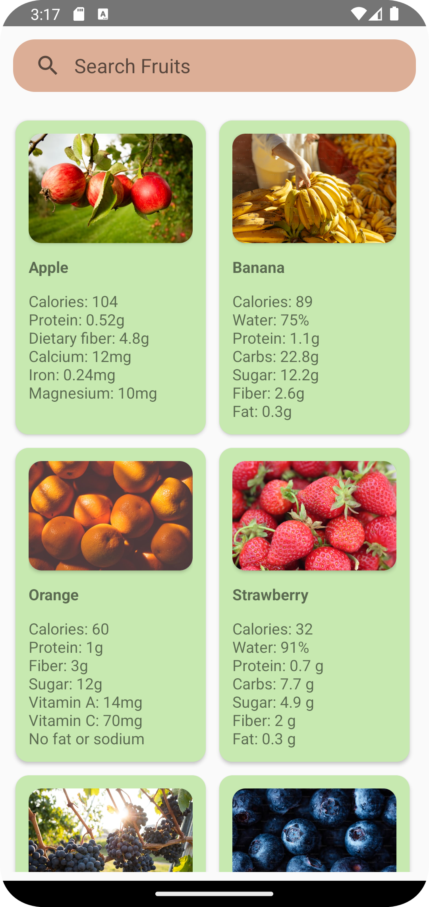
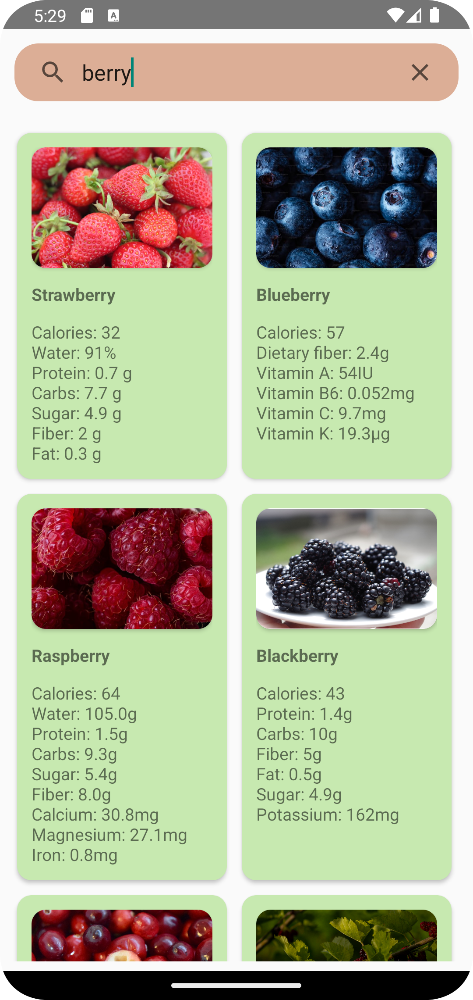

# Fruits-Nutrition-App : RoomDatabase

The Fruits App is a simple Android application that displays a list of fruits using a RecyclerView with CardView items. The app utilizes a Room database to store and retrieve fruit data locally.

## Features

- Display a list of fruits with images and its nutritiondetails in a RecyclerView.
- Store fruit data locally using Room database.
- Search functionality to filter fruits based on user input.
- Responsive UI design with smooth scrolling.

## Dependencies

The App uses the following dependencies:

- Room Persistence Library: Android's recommended library for working with local databases.
  
```
implementation("androidx.room:room-runtime:2.6.1")

annotationProcessor("androidx.room:room-compiler:$room_version")
```
- Picasso: Image loading library for loading and caching images from URLs.
  
```
implementation ("com.squareup.picasso:picasso:2.8") 
```

- RecyclerView
```
implementation 'com.android.support:recyclerview-v7:28.0.0'
```
## Screenshots
  

